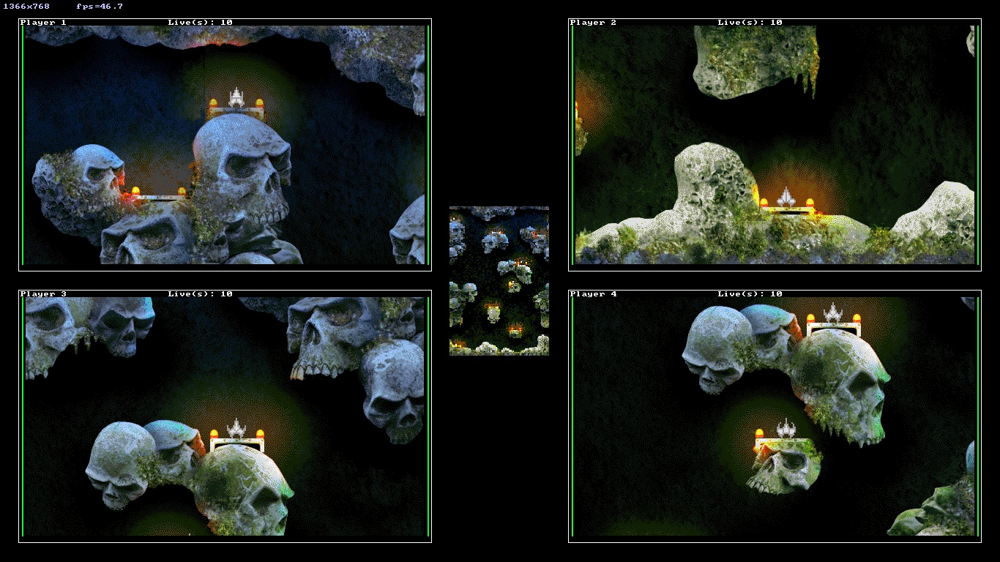

# Mayhem 2 - Raspberry Pi
## Martin O'Hanlon (martin@ohanlonweb.com)
## http://www.stuffaboutcode.com

## Description


Mayhem 2 is a multiplayer (2 - 4) flight shooter with a really simple objective - destroy your opponents before they destroy you.



[Mayhem](http://www.lemonamiga.com/games/details.php?id=2972) was originally released as Public Domain / Shareware on the [Amiga](https://en.wikipedia.org/wiki/Amiga). It was ported to the PC in 2002 by [devpack](https://github.com/devpack) and released onto github in 2011 [github.com/devpack/mayhem](https://github.com/devpack/mayhem). 

[Video of the original amiga game](https://www.youtube.com/watch?v=fs30DLGxqhs).

[Video of Mayhem 2](https://youtu.be/Vxozz0Ijdr0)

[Martin O'Hanlon](https://github.com/martinohanlon) picked it up from [code.google.com/p/mayhem](https://code.google.com/archive/p/mayhem/) ([New BSD License](https://opensource.org/licenses/BSD-3-Clause)) and with the help of Lee Taylor added new levels and features. [Jonas Karlsson](https://github.com/karjonas) migrated Mayhem 2 to [allegro 5](http://liballeg.org/).

[Video of a new level in Mayhem 2](https://youtu.be/E3mho6J6OG8)

This is the [Raspberry Pi](https://www.raspberrypi.org) port of the game, you can find the Windows PC fork at [github.com/martinohanlon/mayhem](https://github.com/martinohanlon/mayhem). 

[Blog post](http://www.stuffaboutcode.com/2016/04/mayhem-classic-amiga-game-ported-to.html)

## Gameplay

Destroy your opponents by shooting them, you win when all other players have run out of lives.

Your ship has limited fuel which will run down when you boost, if you run out you will be unable to control your ship, to refuel, land on any flat surface.

You can protect yourself from attack using your shields which will stop all bullets, be careful though your shields run down quickly and you wont be able to boost while your shields are on. 

Powerups are dropped (sometimes) when a player is destroyed (by either crashing or being shot) and when collected will give you a temporary boost.

### Options

Levels 1-3 are the original game levels, all other levels are new to Mayhem 2.

DCA are anti spaceship guns which will fire at the player if they get too close.

Wall collision can be turned off for new players to get used to the controls and playing the game.

## Controls

### Joysticks

Default joystick controls, assume an "xbox / ps like" joystick:

Control | Action
--- | --- 
Stick 1 | Left / Right
Button 1 (A) | Thrust
Button 2 (B) | Shield
Button 6 (RB) | Fire

Joystick controls can changed using the menu.

### Keys

If joysticks are connected, they are used as the players controls, if there are less than 4 joysticks connected, keys are used for the rest of the players in order:

Key | Left | Right | Shield | Thrust | Fire
--- | --- | --- | --- | --- | ---
1 | z | x | c | v | g 
2 | left | right | pad del | pad 0 | pad enter
3 | b | n | , | m | l
4 | y | u | o | i | 0

## Setup

Mayhem 2 needs at least 96MB of RAM dedicated to the GPU, you can set this using `raspi-config`

```
sudo raspi-config
```

`Advanced Options` > `Memory Split` > change value to 96

## Install

You will need to download the game and install libdumb1 dependency 

```
sudo apt-get install libdumb1
git clone -b allegro5 https://github.com/martinohanlon/mayhem-pi
```

## Run

```
cd mayhem-pi
./start.sh
```

## Compile

Compiling Mayhem2 will need [allegro 5](https://http://liballeg.org/) to be compiled and installed - this will take a while, particularly on a Pi 0/1.

```
cd mayhem-pi
./compile_allegro5
```

To compile Mayhem2.

```
make
```

To compile Mayhem2 to distribute, including static linking to the allegro libraries. Modify compile_allegro to include the additional flags, recompile and use Makefilestatic.

```
make clean
make -f Makefilestatic
``` 

## RetroPie 

To install Mayhem to the 'ports' section of RetroPie:

```
cd /home/pi/RetroPie/roms/ports
sudo apt-get install libdumb1
git clone -b allegro5 https://github.com/martinohanlon/mayhem-pi
```

## Version history
* beta - compiles, runs, ongoing mods
* 0.1 - added new levels and features
* 0.2 - seamless warping across map edges
* 0.4 - menu changes + new 'option' (powerup) changes
* 0.5 - timing and powerups are now dropped when players explode
* 0.6 - new thrust powerup + bug fix
* 0.7 - level structure changes
* 0.8 - joystick control
* 0.9 - new powerup icons
* 0.10 - screen resolution & perf improvements
* 0.11 - screen rendering, timing changes, bug fix
* 0.12 - allegro5 migration

## Contributors
[Anthony Prieur](https://github.com/devpack)

[Martin O'Hanlon](https://github.com/martinohanlon)

Lee Taylor

[Jonas Karlsson](https://github.com/karjonas)
